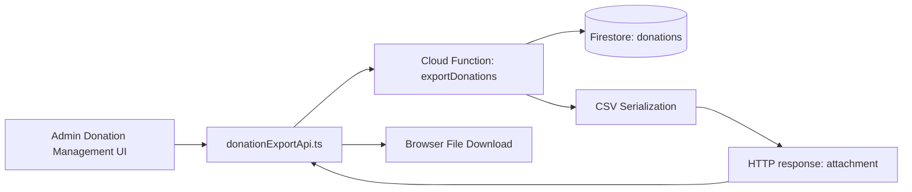
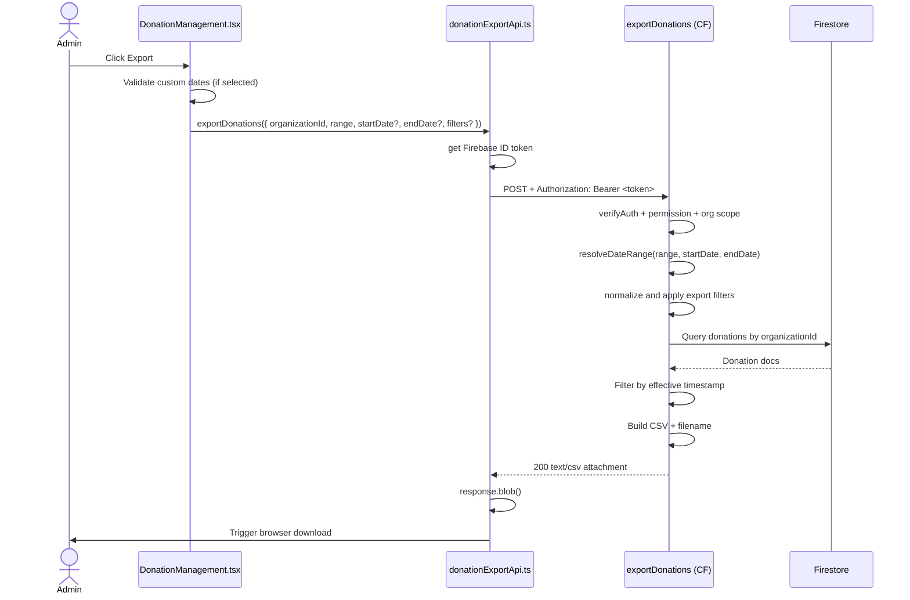
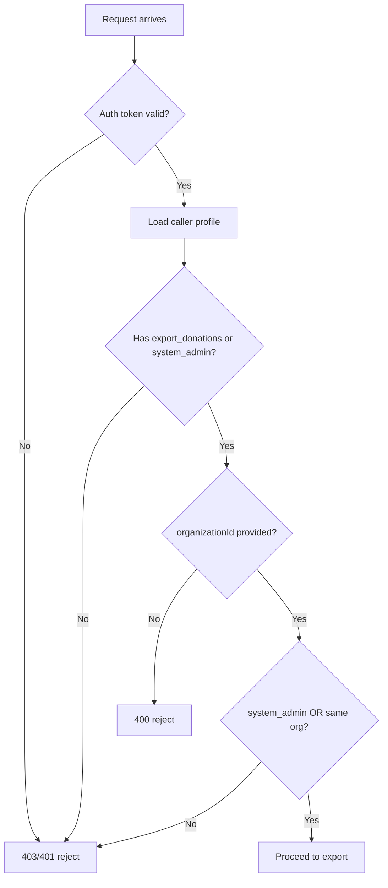

# Donation Export Flow

## 1) Purpose

This document explains the **server-side Donation Export flow** end-to-end:

- what it does
- why it was built this way
- how each layer works
- where to modify it safely

This flow replaces client-side CSV generation with a backend function so exports are complete (not limited by UI pagination), permissioned, and auditable.

---

## 2) Scope

### In Scope

- Admin-triggered donation CSV export
- Date range filtering (`current_month`, `past_month`, `custom`)
- Server-side filter support (`searchTerm`, `status`, `campaignId`, `recurring`, `date`)
- Backend permission and organization checks
- CSV generation and download response

### Out of Scope

- Donation export history/batch tracking
- Scheduled/automatic exports
- Gift Aid export internals (separate flow)

---

## 3) Files and Ownership

### Backend

- `backend/functions/handlers/donationsExport.js`
  - Request validation
  - auth + permission enforcement
  - date range resolution
  - donation filtering
  - CSV serialization + response

- `backend/functions/index.js`
  - Cloud Function registration (`exports.exportDonations`)

### Frontend

- `src/shared/config/functions.ts`
  - Export function URL mapping (`FUNCTION_URLS.exportDonations`)

- `src/entities/donation/api/donationExportApi.ts`
  - Calls function with bearer token
  - handles response + file download

- `src/views/admin/DonationManagement.tsx`
  - export controls UI (desktop + mobile behavior)
  - request payload assembly
  - export trigger + error/success toasts

---

## 4) High-Level Architecture

---

## 5) End-to-End Sequence

---

## 6) Why Server-Side Export

## 6.1 Completeness

UI tables are paginated and filtered for viewing. Export must not miss records due to page size or current table state.

## 6.2 Security

Backend enforces permission and org boundaries. Client-only export cannot be treated as trusted.

## 6.3 Consistency

Single date-range and CSV schema logic in one backend place avoids frontend drift.

## 6.4 Operational Simplicity

Front-end only sends intent (`range`, dates); backend decides data and output.

---

## 7) Backend Request Contract

Endpoint: `POST /exportDonations`

Required:

- `organizationId: string`
- `range: "current_month" | "past_month" | "custom"`

Conditional:

- `startDate: "YYYY-MM-DD"` (required for `custom`)
- `endDate: "YYYY-MM-DD"` (required for `custom`)
- `filters?: {`
  - `searchTerm?: string`
  - `status?: string`
  - `campaignId?: string`
  - `recurring?: "all" | "recurring" | "one_time" | string`
  - `date?: "YYYY-MM-DD"`
- `}`

Error behavior:

- `400` for bad input/range/date mismatch
- `403` for permission/org-scope violation
- `405` for wrong method
- `500` unexpected error

---

## 8) Permission and Access Control

In `donationsExport.js`:

- `verifyAuth(req)` validates Firebase ID token
- user profile loaded from `users/{uid}`
- allowed when:
  - `permissions` contains `export_donations`, or
  - `permissions` contains `system_admin`
- non-system-admin users can export only for their own `organizationId`

---

## 9) Date Range Resolution and Validation

## 9.1 Modes

- `current_month`: UTC start/end of current month
- `past_month`: UTC start/end of previous month
- `custom`: explicit `startDate` + `endDate`

## 9.2 Strict Custom Date Validation

`parseDateOnly(...)` enforces:

- exact `YYYY-MM-DD`
- numeric month/day constraints
- real calendar date (no normalization drift)

Example:

- `2026-02-31` is rejected (instead of rolling into March)

## 9.3 Timezone Model

All boundaries are computed in **UTC** to avoid timezone ambiguity across admin browsers and servers.

---

## 10) Donation Selection Logic

Query:

- Firestore `donations` where `organizationId == requested organization`

Filter:

- Date filtering is applied in memory using a timestamp precedence:
  1. `paymentCompletedAt` (primary)
  2. `timestamp` (fallback)
  3. `createdAt` (fallback)
- After date-range filtering, additional server-side export filters are applied:
  - `searchTerm` matches donor name, payment intent id, transaction id, or campaign display name
  - `status` matches `paymentStatus`
  - `campaignId` matches donation campaign
  - `recurring` maps to recurring vs one-time donations
  - `date` matches effective timestamp date (`YYYY-MM-DD`)

Records without a parseable effective timestamp are excluded.

Reasoning:

- historical donation records may not have all timestamp fields populated consistently.

---

## 11) CSV Schema

Current exported column order:

1. `donorName`
2. `donorEmail`
3. `campaign`
4. `amount`
5. `currency`
6. `paymentStatus`
7. `isGiftAid`
8. `isRecurring`
9. `recurringInterval`
10. `subscriptionId`
11. `invoiceId`
12. `transactionId`
13. `platform`
14. `timestamp`

Derived fields:

- `campaign`: snapshot title -> live title -> `Deleted Campaign`
- `isRecurring`: inferred from multiple subscription-related fields
- `timestamp`: ISO string of effective timestamp

Filename format:

- `donations-{range}-{YYYYMMDD}-{YYYYMMDD}.csv`

---

## 12) CSV Security Hardening

Problem:

- Spreadsheet apps can evaluate formulas in CSV cells that start with:
  - `=`, `+`, `-`, `@`

Mitigation in `donationsExport.js`:

- `sanitizeSpreadsheetFormula(value)` prefixes `'` to formula-like string cells
- then normal CSV escaping is applied

This protects donor-controlled text fields when admins open CSV in Excel/Sheets.

---

## 13) Frontend Integration

## 13.1 `donationExportApi.ts`

- gets Firebase ID token from current user
- calls `FUNCTION_URLS.exportDonations`
- handles backend errors robustly
- reads `Content-Disposition` for filename
- downloads blob via temporary object URL

## 13.2 `DonationManagement.tsx`

- manages export state:
  - `exportRange`
  - `exportStartDate`
  - `exportEndDate`
  - `isExporting`
- validates custom dates before request
- triggers export API call
- shows success/error toast feedback
- supports mobile export interaction (dropdown/panel pattern) and desktop inline controls

---

## 14) Failure Modes and Expected Errors

Common cases:

- Missing auth token in frontend
  - user sees login/auth error
- Function URL unreachable
  - user sees endpoint/network error
- custom range without dates
  - frontend warning + no request
- malformed custom dates
  - backend `400`
- permission denied or org mismatch
  - backend `403`

---

## 15) Observability and Debugging

Backend logs:

- `Error exporting donations:` with stack/context in Cloud Functions logs

Recommended checks:

1. Confirm request payload contains expected `organizationId`, `range`, `startDate`, `endDate`.
2. Confirm caller has `export_donations` or `system_admin`.
3. Confirm function URL resolves to correct project/region.
4. Confirm response headers include:
   - `Content-Type: text/csv; charset=utf-8`
   - `Content-Disposition: attachment; filename="..."`

---

## 16) Local Development and Emulator Notes

- frontend function URLs are generated from Firebase project + emulator config
- if emulating functions, ensure frontend points to emulator base URL
- if using production backend from local frontend, ensure emulator overrides are disabled

---

## 17) How to Extend Safely

## Add a CSV Column

1. add field in `buildExportRows(...)`
2. add matching header in `EXPORT_HEADERS`
3. keep order aligned
4. test spreadsheet opening

## Add a New Range Type

1. extend `DonationExportRange` in frontend type
2. add UI option in `DonationManagement.tsx`
3. implement resolution branch in `resolveDateRange(...)`
4. validate date semantics

## Add Extra Security Checks

1. keep checks server-side
2. return explicit 4xx errors
3. avoid silently coercing invalid input

---

## 18) Suggested Test Matrix

### Unit-Level (backend handler helpers)

- valid/invalid `YYYY-MM-DD` parsing
- current/past/custom range boundaries
- effective timestamp fallback order
- CSV escaping and formula sanitization

### Integration-Level

- export success for each range
- org mismatch returns `403`
- missing permission returns `403`
- malformed custom date returns `400`
- blob download occurs with expected filename

---

## 19) Current Tradeoffs and Future Improvements

Tradeoff:

- filtering by effective timestamp currently occurs in memory after org query

Potential improvement:

- denormalize and persist a single indexed `effectiveTimestamp` to support range querying directly in Firestore for large datasets

Potential product improvement:

- store export batches/history for donations (similar to Gift Aid flow) if repeat-download and audit requirements emerge

---

## 20) Quick Reference

### Trigger Point

- Admin Donations page -> Export controls

### Backend Entry

- `exports.exportDonations` in `backend/functions/index.js`

### Core Logic

- `backend/functions/handlers/donationsExport.js`

### Frontend API Bridge

- `src/entities/donation/api/donationExportApi.ts`

### Function URL Mapping

- `src/shared/config/functions.ts`
